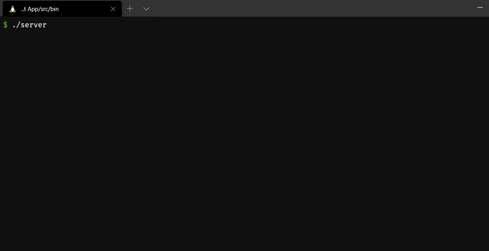
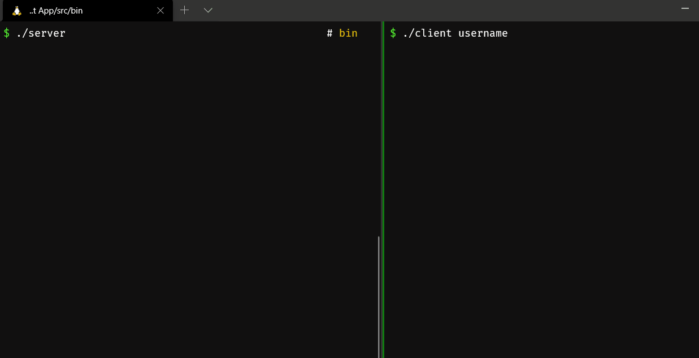
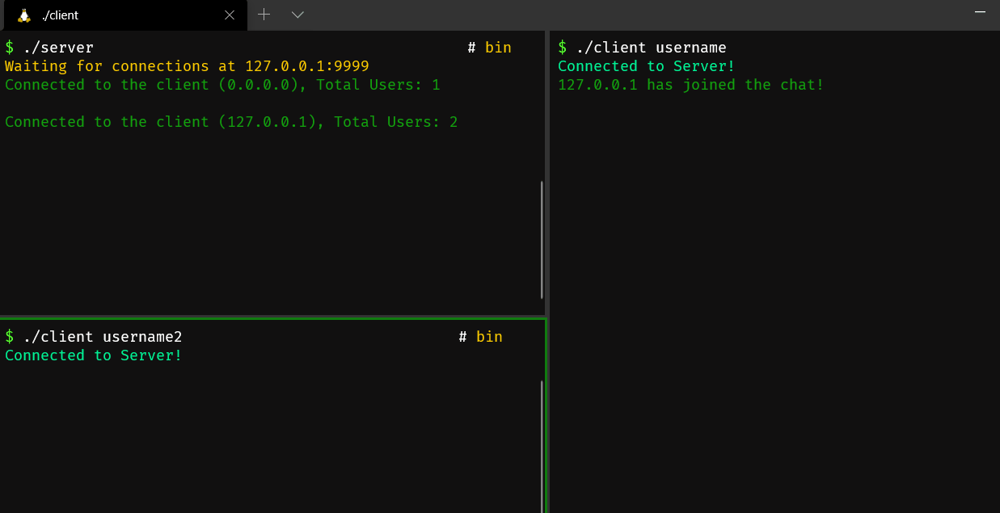
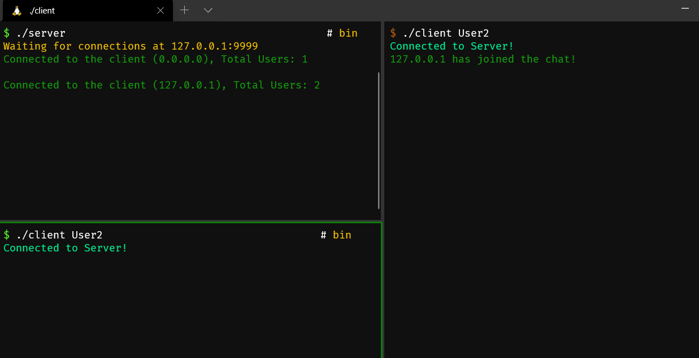
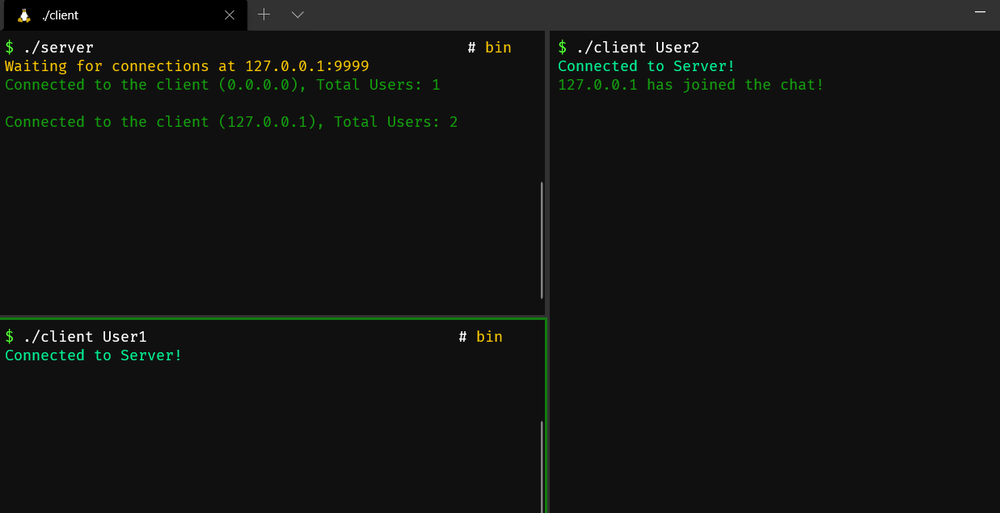

# ChatOps!
### A Chatting App using sockets in C.
____

## Introduction 
*"This app was developed so a group of people (probably programmers) could talk on a console based Chat Application in a group maybe discussing a cool startup idea."*

Okay, so this app uses Sockets in C. A server is running that accepts client requests and lets them in. The message sent by each memeber is them broacasted to the entire group with name of the sender. This app runs only on Unix-Styled Operating Systems.

___

## Techstack
This application is written entirely in C Language. It uses the `gcc` complier for the compilation. It uses the `pthread` library for making the server multithreaded.

___

## Showcasing the product

**1. Starting the server:** First ofall the server is started by runner the `server` binary. This opens the `port 9999` at the `localhost` IP. Then it listens for the users to connect to it.

___
**2. Client Connecting with the server:** When the users are connecting to the server. They need to provide the name that they wish to use as a command line argument to the `client` binary so that other people can use that for referencing and seeing their messages.

___
**3. Sending/Broachcasting messaging and server logging:** Whenever a client sends a message the server logs that message into it's console for further reference and debugging. The server print the name of the user followed by the message that they have sent.

___
**4. Exiting the connection:** Whenever a user wishes to end the connection they just need to press `Control + C` to provided the `SIGINT` signal to the user. Then it lets the server know that this client wants to disconnect. The server then closes the connection and frees the memory for the client and lets all the other users know that this user has left the chat.

___

**5. Server Deciedes to Exit:** Whenever the `server` wishes to leave. It closes all the connections and lets all the other users know that the server has disconnected and exits the program for all the connected clients.

___

## Brief under the hood working.
What happens in this app is pretty simple.
1. First the server is started. It waits for connections and for each connection it uses anther thread to handle each other clients. Each tread attachs another listener to each client socket so that everyone could communicate at all times.
2. Evenever each of the clients disconnects the socket is disposed safely and all the memory is cleared.
3. Whenever a user sends a message it gets received by the server along with the name of the user who sent that message. The server logs this information and also broadcasts this message to all the connected users so that they can see the message as well.
4. Then whenever a user wishes to disconnect `SIGINT` interrupt is given out by `Control + C` and this sends a request to server that this client wants to disconnect. The server also lets all the other connected users know that this client wants to disconnect. The server cleans up after the client and closes the connection. The client end also frees any memory that it has taken closes the connection safely.
5. If the sever wishes to disconnect it sends this request to all the clients. They clean up and close their respective sockets. The server also cleans up and quits the program.